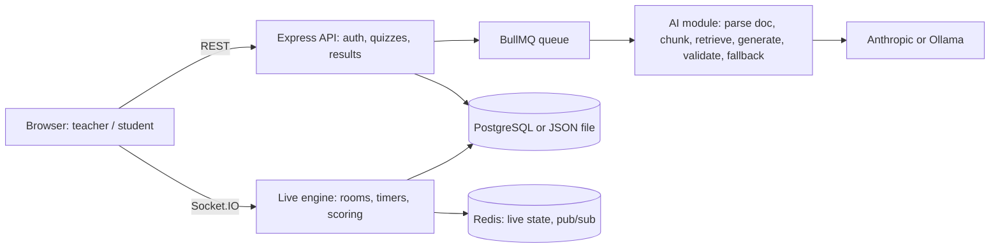

# QuizForge AI

**Real-time AI quiz platform with source-grounded question generation and learning analytics.**

A teacher uploads notes (PDF, DOCX, PPTX, text, code...) or types a topic. QuizForge turns it into multiple-choice questions that cite their source page, hosts it live with a room code, QR code and join link, scores players by correctness and speed, and afterwards tells the teacher which concepts the class struggled with and what to re-teach.

> Status: working full-stack project with automated tests. See [Tested vs. not tested](#tested-vs-not-tested) for exactly what has and hasn't been verified.

---

## Table of contents
1. [Features](#features)
2. [Quick start](#quick-start)
3. [AI setup (Ollama, Anthropic, or none)](#ai-setup)
4. [Architecture](#architecture)
5. [How the live engine works](#how-the-live-engine-works)
6. [Redis design](#redis-design)
7. [Configuration](#configuration)
8. [API and socket reference](#api-and-socket-reference)
9. [Testing and load testing](#testing-and-load-testing)
10. [Deployment](#deployment)
11. [Tested vs. not tested](#tested-vs-not-tested)
12. [Known limitations](#known-limitations)
13. [Roadmap](#roadmap)
14. [Project structure](#project-structure)

---

## Features

**Question generation**
- From a **topic**, or from an **uploaded document**: PDF (real page numbers via pdf.js), DOCX, PPTX (per slide), TXT, Markdown, CSV, JSON, HTML and source-code files.
- **Source-grounded:** each question is written from a single page of your material, checked against that page, and labelled (for example `Page 3` or `Slide 7`).
- **Works for any file:** if the AI is slow, unavailable or returns bad output, an offline generator fills the remaining questions with cited fill-in-the-blank questions built directly from the text. Uploads never end in a "could not generate" error unless the file has no readable text.
- Works with **Ollama** (local, free), **Anthropic**, or no AI at all.
- Output is validated: exactly four distinct options, a valid answer index, difficulty and concept tags. Model output in slightly wrong shapes (letter answers, renamed fields, wrapped JSON) is repaired instead of rejected.
- Generation runs through a **BullMQ queue** (3 attempts, exponential backoff) when Redis is configured.

**Live quiz**
- 4-digit room codes, shareable join links and **QR join**.
- **Server-authoritative timers and scoring:** clients cannot fake speed. Score is 500 for a correct answer plus up to 500 for speed.
- **Idempotent answers:** one answer per player per question; duplicates are acknowledged, not re-scored.
- Automatic reveal when everyone has answered or time runs out, then automatic progression to the next question.
- Players don't receive the correct answer during the round. The teacher sees the answer distribution live.
- **Reconnect and resume:** refreshing the page or losing network restores the exact state (question, remaining time, reveal).
- **Late join:** students can enter an active quiz, get the current question with a synchronized timer, and start at zero points.
- Guests can join with just a name; logged-in students get a history.

**Analytics**
- Class accuracy, accuracy per concept, per-question results, and the most common wrong answer.
- **AI teaching insight:** a short explanation of the likely misconception and a 5-minute re-teach suggestion (rule-based tips when no AI is available).
- **One-click remedial quiz** generated from the weakest concepts.
- Teacher-only: students receive the leaderboard and their own score/rank, never class analytics.
- Student performance history across quizzes.

**Platform**
- Teacher and student accounts: scrypt password hashing, signed expiring tokens, role-protected API, login rate limiting.
- PostgreSQL persistence (JSONB document store), or a local JSON file with zero setup.
- Redis for live state, cross-server messaging and the job queue; an in-memory stand-in when Redis isn't configured.
- Docker, Docker Compose, GitHub Actions CI.

---

## Quick start

Requires **Node.js 20+**. No database or Redis needed for the first run.

```bash
npm install
npm start
# open http://localhost:3000
```

1. Register as a **Teacher**.
2. Create a quiz: type a topic, or upload a file (leave the topic blank and it is named after the file).
3. Click **Host live** and share the room code, link or QR code.
4. Join from another tab or phone (guest, or register as a Student).
5. Watch the live leaderboard, then open **Insights** and generate a remedial quiz.

Settings live in a `.env` file (copy `.env.example`); the app reads it automatically.

---

## AI setup

QuizForge picks a provider in this order: **Anthropic** (if `ANTHROPIC_API_KEY` is set) -> **Ollama** (auto-detected) -> **offline generator**. Every quiz records which engine produced it: `ai`, `mixed`, `extractive` or `bank`.

### Option A: Ollama (free, local)
1. Install [Ollama](https://ollama.com) and make sure it is running (tray app on Windows/macOS, `ollama serve` on Linux).
2. Pull a model that follows JSON instructions well:
   ```bash
   ollama pull llama3.2:3b     # small and fast
   ollama pull qwen2.5:7b      # better quality, needs more RAM
   ```
   Very small models such as `phi3:mini` often fail at structured output.
3. Start QuizForge. Ollama is found at `http://127.0.0.1:11434` automatically and the first installed model is used. To choose a model or host, set `OLLAMA_MODEL` / `OLLAMA_URL` in `.env`.
4. Verify: log in as a teacher and open `/api/ai/status`.

On CPU-only machines a 5-question quiz can take 1 to 3 minutes. After `GEN_BUDGET_MS` (default 170 s) the offline generator completes whatever is missing.

### Option B: Anthropic
Set `ANTHROPIC_API_KEY` (and optionally `MODEL`).

### Option C: no AI
Topic mode uses a built-in question bank. Document mode uses the offline extractive generator. Quality is plainer than AI-written questions, but everything works.

### How document generation works
```text
upload -> extract text -> split into pages -> pick relevant pages
       -> one small AI request per page (JSON-schema constrained if supported)
       -> tolerant parse + validation -> check the answer is supported by that page
       -> top up with offline cited questions if anything is missing
```
Scanned or image-only PDFs contain no text; the app tells you to run OCR first.

---

## Architecture



**Key design decisions**
- **Server time is the only clock.** The server stamps each question and measures every answer, so a client can't claim to be faster.
- **Live state in Redis, game timers on one owner.** Scores, answers and counters live in Redis so any server instance can serve any player. The instance that hosts a room runs its timers; other instances signal it over pub/sub when everyone has answered.
- **Retrieval is keyword-based on purpose:** no extra paid API and easy to explain. `retrieve()` is the seam for swapping in embeddings.
- **The AI is never a single point of failure.** Validation, per-page requests, retries and an offline generator mean a bad model response degrades quality rather than breaking the feature.
- **Teacher data stays on the teacher's socket.** Analytics are emitted only to the host room; students get the leaderboard.

---

## How the live engine works

1. **Host starts** a saved quiz: a room is created with a 4-digit code.
2. **Players join** by code, link or QR. Names are claimed atomically (`HSETNX`), so duplicates are rejected even across servers.
3. **Question phase:** the server sets `status=question`, stamps `qStart`, broadcasts the question (without the answer) and starts the timer.
4. **Answering:** each answer is checked against the server clock, written once with `HSETNX` (idempotent), scored, and added to the leaderboard sorted set.
5. **Reveal:** when everyone has answered (or time is up) the host sees the answer and distribution, each player gets their own points and rank.
6. **Auto-advance** to the next question; after the last one the results are saved, analytics and the AI insight are generated, and everyone gets their final view.

---

## Redis design

| Concern | Structure |
|---|---|
| Cross-server events | Socket.IO Redis adapter (pub/sub) |
| Leaderboard | Sorted set `lb:CODE` (`ZINCRBY` per answer, `ZREVRANGE` for top N) |
| Duplicate-answer protection | `HSETNX ans:CODE:Q pid` (atomic across servers) |
| Unique player names | `HSETNX names:CODE` |
| Per-option counts | `HINCRBY cnt:CODE:Q` |
| "Everyone answered" | Pub/sub signal to the room's owner instance |
| Generation jobs | BullMQ queue; `RUN_WORKER=0` disables the worker on an instance |
| Restart recovery | Rooms re-adopted from Redis by `INSTANCE_ID`; the game loop resumes |

Without `REDIS_URL` the same code path runs on an in-memory stand-in (single instance, generation runs inline with one retry).

---

## Configuration

All variables are optional.

| Variable | Purpose | Default |
|---|---|---|
| `PORT` | HTTP port | `3000` |
| `JWT_SECRET` | Token signing secret. **Required** in production | dev value |
| `ANTHROPIC_API_KEY` | Use Anthropic for generation and insights | unset |
| `MODEL` | Anthropic model name | `claude-sonnet-4-5` |
| `OLLAMA_URL` | Ollama address | `http://127.0.0.1:11434` (auto-detected) |
| `OLLAMA_MODEL` | Ollama model | first installed model |
| `DATABASE_URL` | PostgreSQL connection string | local `data/db.json` |
| `REDIS_URL` | Redis connection string | in-memory stand-in |
| `INSTANCE_ID` | Stable ID of this server (room ownership after restart) | `default` |
| `RUN_WORKER` | Set to `0` to stop this instance running queue workers | on |
| `GEN_BUDGET_MS` | Max time on AI calls per quiz before the offline generator fills the rest | `170000` (Ollama), `60000` (Anthropic) |
| `LLM_TIMEOUT_MS` | Timeout per AI call | `180000` |
| `GEN_WAIT_MS` | How long a request waits for a queued generation job | `300000` |

---

## API and socket reference

**REST** (`Authorization: Bearer <token>`)

| Method and path | Who | Purpose |
|---|---|---|
| `POST /api/register`, `POST /api/login` | public (rate limited) | Create account / log in |
| `GET /api/me` | any user | Current user |
| `GET /api/ai/status` | teacher | Detected AI provider and models |
| `GET /api/quizzes` | teacher | My quizzes |
| `POST /api/quizzes` | teacher | Generate a quiz from topic and/or uploaded file |
| `GET /api/results` | teacher | Past sessions with analytics |
| `POST /api/results/:id/remedial` | teacher | Remedial quiz on the weakest concepts |
| `GET /api/history` | student | My past results |
| `GET /api/qr/:code` | public | QR code (SVG) for a room |
| `GET /health` | public | Liveness |

**Socket.IO, client to server:** `host:start`, `player:join`, `resume`, `host:next`, `answer`.
**Server to client:** `lobby`, `question`, `reveal` (host), `me`, `player:roundEnd`, `player:final`, `progress` (host), `end`.

---

## Testing and load testing

```bash
npm test               # 10 tests: unit, auth, document parsing, AI fallbacks, fake Ollama, full end-to-end game
npm run test:redis     # 2-server test on a real Redis (needs REDIS_URL)
npm start              # in another terminal:
npm run loadtest -- 300   # registers a teacher, hosts a quiz, plays N bots, prints p50/p95/p99
```

What the tests cover: question validation and tolerant parsing, password and token handling, page-accurate PDF extraction, the offline generator, uploading a PDF with no AI provider, a fake Ollama server (provider detection, per-page prompts, schema use, top-up), a full game from registration to student history, teacher-only analytics, QR route, login rate limiting, and a two-server game sharing one Redis (cross-server events, merged leaderboard, duplicate rejection, name uniqueness, queue).

**Measured result** (shared cloud sandbox, server, Redis and bots on one machine, Redis mode, 300 players, 900 answers, 3 questions): answer-ack p50 1 ms, p95 3 ms, p99 6 ms; question fan-out p50 24 ms, p95 71 ms.
This was measured on an earlier build of the Redis layer on loopback, so treat it as indicative. **Re-run it against your deployed URL and quote only your own numbers.**

---

## Deployment

1. Provision PostgreSQL and Redis (Render, Railway, Fly.io, Neon, Upstash...).
2. Set `JWT_SECRET`, `DATABASE_URL`, `REDIS_URL`, and an AI provider (`ANTHROPIC_API_KEY`; Ollama only works if the server can reach it).
3. Build `npm install`, start `npm start`. WebSockets must be enabled (they are on the platforms above).
4. If you run more than one instance, give each a unique `INSTANCE_ID` and enable **sticky sessions** so the host's connection reaches the instance that owns the room.
5. Locally: `docker compose up --build` starts the app with PostgreSQL and Redis.

---

## Tested vs. not tested

| Area | Status |
|---|---|
| Game logic, scoring, idempotency, reconnect, auth, analytics | Automated tests pass |
| PDF text extraction and offline question generation | Tested on a generated PDF fixture |
| Ollama integration | Tested against a fake Ollama server; **not** against a real model in CI |
| Redis live state, adapter, queue, two-server play | Tested on a real Redis |
| PostgreSQL | Code written, **not run against a live Postgres** |
| Browser UI | Manually used; no automated browser tests |
| Production deployment and real-network load | **Not done yet** |

## Known limitations

- Scanned/image-only PDFs need OCR before upload.
- Offline-generated questions are fill-in-the-blank only and plainer than AI-written ones; distractors can occasionally be weak.
- Retrieval is keyword-based, so it can miss paraphrased content that embeddings would find.
- The host connection must reach the instance that owns the room (sticky sessions).
- A crash between the idempotency check and the leaderboard update can drop one answer's points; a Lua script would make it fully atomic.
- `KEYS` is used once at startup for room recovery (fine at this scale).
- The frontend is vanilla JavaScript, not React/TypeScript.
- Question text from the AI is not manually reviewed before a quiz is hosted.

## Roadmap

**Next (highest value)**
- [ ] Deploy publicly with a live demo link and a 90-second demo video
- [ ] Teacher review and edit screen for generated questions before hosting
- [ ] Run and document a load test against the deployed URL
- [ ] Test against a real PostgreSQL in CI

**Quality**
- [ ] Embeddings-based retrieval (semantic RAG) behind `retrieve()`
- [ ] OCR for scanned PDFs
- [ ] Better offline questions (true/false, definition matching, numeric)
- [ ] Atomic answer scoring with a Redis Lua script
- [ ] Browser end-to-end tests (Playwright)

**Product**
- [ ] Adaptive difficulty per student during a live quiz
- [ ] Team mode, question types beyond MCQ, image questions
- [ ] Export results to CSV, per-student reports for teachers
- [ ] Accessibility pass and multi-language support

**Engineering**
- [ ] React + TypeScript frontend
- [ ] Relational PostgreSQL schema instead of the JSONB document store
- [ ] Separate worker deployment, metrics and tracing (Prometheus/OpenTelemetry)

---

## Project structure

```text
server.js              Express API, Socket.IO game engine, results and analytics
lib/ai.js              Providers, per-page generation, parsing, offline generator, insights
lib/document.js        PDF (pdf.js), DOCX, PPTX and text extraction
lib/live.js            Live quiz state on Redis (leaderboard, answers, counters)
lib/store.js           Redis client, or in-memory stand-in
lib/queue.js           BullMQ generation queue, or inline fallback
lib/db.js              PostgreSQL (JSONB) or JSON-file document store
lib/auth.js            scrypt hashing, signed tokens
lib/env.js             .env loader
public/index.html      Single-page UI (teacher dashboard, student view, live quiz)
test/                  app tests, Redis multi-instance test, PDF fixture
loadtest.js            Self-contained load/latency benchmark
Dockerfile, docker-compose.yml, .github/workflows/ci.yml
```

---


