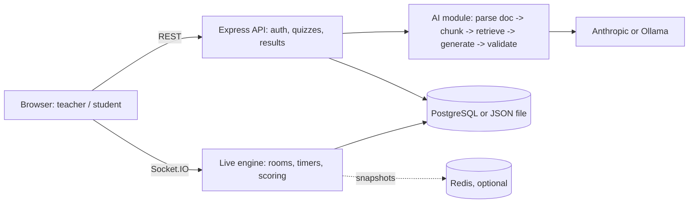

# QuizForge AI — Real-Time AI Quiz & Learning Analytics Platform

QuizForge AI is a portfolio-grade full-stack assessment platform for teachers and students. It combines source-grounded AI question generation with a server-authoritative live quiz engine, speed-aware scoring, real-time progress, leaderboards, persistent results, and AI teaching insights.

## What is included

- Teacher/student accounts with signed tokens and scrypt password hashing
- Topic-based AI question generation
- Source-grounded generation from uploaded PDF, DOCX, PPTX, TXT, Markdown, CSV, JSON, HTML and source-code documents with source labels
- Anthropic support or local Ollama support (`OLLAMA_URL` + `OLLAMA_MODEL`)
- JSON validation and safe fallback question bank when no AI provider is configured
- Live Socket.IO rooms with 4-digit codes and shareable join links
- Server-authoritative timers and speed-weighted scoring
- Idempotent answer submission / duplicate-answer protection
- Automatic reveal and automatic next-question progression
- Students do not receive the correct answer during the live round; their final score/rank is shown after the quiz
- Teacher-only answer reveal and response distribution
- Reconnect/resume support using per-tab session storage
- Late join support: students can enter an active quiz, receive the current question and synchronized remaining timer, and start with zero points
- PostgreSQL persistence when `DATABASE_URL` is configured, otherwise local JSON storage
- Optional Redis room snapshots for restart recovery
- Teacher analytics: class accuracy, weak concepts, common wrong answers and AI re-teach insight
- One-click remedial quiz generation from weak concepts
- Student performance history
- Docker Compose setup for PostgreSQL + Redis
- Unit/integration/e2e test suite and load-test script

## Run locally on Windows

1. Install Node.js 20+.
2. Open this folder in VS Code.
3. In the terminal:

```bash
npm install
npm start
```

4. Open http://localhost:3000

No PostgreSQL or Redis is required for the first run; the app uses `data/db.json`.

## Local AI with Ollama

If Ollama is installed and running:

```bash
ollama pull phi3:mini
```

Set:

```text
OLLAMA_URL=http://127.0.0.1:11434
OLLAMA_MODEL=phi3:mini
```

Then restart the server. If you do not configure an AI provider, QuizForge still runs with its built-in sample question bank.

## Hosted AI

Set `ANTHROPIC_API_KEY` before starting the server. You can change `MODEL` in `.env` if you want another supported Anthropic model.

## Docker

```bash
docker compose up --build
```

This starts the app, PostgreSQL and Redis. The application automatically uses PostgreSQL and Redis when their environment variables are present.

## Test

```bash
npm test
```

## Load test

The project includes `loadtest.js`. Only use performance numbers in a resume after running the test yourself against the deployed version.

## Recommended demo flow

1. Register as Teacher.
2. Create a quiz such as `Computer Networks — TCP Congestion Control`.
3. Optionally upload a PDF/DOCX/PPTX/TXT/MD or paste notes; if a document is uploaded, leave Topic blank and QuizForge derives the quiz subject from the file.
4. Click `Host live`.
5. Open the displayed join link in another browser/tab.
6. Join as `Student1`.
7. Start the quiz.
8. Open the join link a little late in another tab; the late student is admitted to the current question with synchronized remaining time and zero starting score.
9. Answer from the student tab.
9. Let the timer expire: the next question advances automatically.
11. Finish the quiz and show the student's final score/rank.
12. Return to the teacher view and open the session insights.
13. Generate the remedial quiz from the weakest concepts.

## Topics you can use

The UI includes a topic library for:

- Data Structures & Algorithms
- Operating Systems
- Computer Networks
- DBMS / SQL
- OOP
- C / C++ / Java / Python / JavaScript
- Web Development
- AI / Machine Learning
- Cybersecurity
- Cloud Computing / DevOps
- Software Engineering / Testing / Git
- Computer Architecture / Digital Logic
- Aptitude / Logical Reasoning

You are not restricted to these. Any academic or technical topic can be entered. For document mode, upload a supported document and QuizForge generates four-option MCQs from the extracted source content; it does not silently fall back to unrelated generic questions when a source-grounded generation fails.

## Architecture

```text
React-style SPA (vanilla JS in this version)
        |
   REST + Socket.IO
        |
 Node.js / Express
   |             |
PostgreSQL     Redis
   |             |
users/quizzes   live-room snapshots
results/history
        |
 AI generation layer
  |             |
Anthropic     Ollama
        |
 source retrieval -> validated MCQs -> analytics -> re-teach insight
```

### Design decisions

- Live state is kept in memory for low-latency gameplay, with optional Redis snapshots for restart recovery. Full multi-instance scaling would move live state/leaderboards to Redis and add the Socket.IO Redis adapter.
- Server time is authoritative, so a browser cannot claim a faster response time.
- Student sessions use `sessionStorage`, preventing a second browser tab from accidentally inheriting the host's live-room session.
- The teacher receives answer distributions; students receive a round-complete message and their final score/rank only after the quiz.
- Keyword retrieval is intentionally dependency-light. The retrieval seam can later be replaced by embeddings/vector search without rewriting the quiz engine.

## Future 9.5/10 upgrades

- Embeddings/vector database for semantic RAG
- BullMQ generation worker with retries
- Redis sorted-set leaderboard + Socket.IO Redis adapter for multi-instance scaling
- QR-code join
- More granular PostgreSQL relational schema
- Adaptive per-student question paths
- CI deployment + observability
- k6/Artillery performance report


## Architecture



## Making uploads work (any file) and setting up Ollama
**Uploads always produce questions.** Pipeline: extract text (PDF via pdf.js with real page numbers, DOCX, PPTX, TXT/MD/CSV/JSON/HTML/code) -> split into pages -> one small, focused AI request per page (JSON-schema constrained when the model supports it, tolerant parsing otherwise) -> each question is checked against its page -> anything missing is topped up by an offline generator that builds cited fill-in-the-blank questions straight from the text. If no AI is available at all, the offline generator does everything. Scanned/image-only PDFs have no text to read and need OCR first; the app says so.

**Ollama (local AI), step by step**
1. Install Ollama and make sure it is running (Windows/macOS: the tray app; Linux: `ollama serve`).
2. Pull a model that follows JSON instructions well: `ollama pull llama3.2:3b` (small and fast) or `ollama pull qwen2.5:7b` (better quality, needs more RAM). `phi3:mini` often fails at structured output.
3. Start QuizForge. No configuration is needed: Ollama is detected at `http://127.0.0.1:11434` and the first installed model is used. To choose a model or a remote host, copy `.env.example` to `.env` (the app now reads it) and set `OLLAMA_MODEL` / `OLLAMA_URL`.
4. Check it: log in as a teacher and open `/api/ai/status` in the same browser session, or run `curl http://127.0.0.1:11434/api/tags`.
CPU-only machines are slow: a 5-question quiz can take 1-3 minutes. After `GEN_BUDGET_MS` the offline generator completes the rest, so you never get an error. Each quiz records its `engine`: `ai`, `mixed` or `extractive`.

## Redis architecture (multi-instance ready)
| Concern | Redis structure |
|---|---|
| Cross-instance events | Socket.IO Redis adapter (pub/sub) |
| Leaderboard | Sorted set `lb:CODE` (ZINCRBY per answer, ZREVRANGE for top N) |
| Duplicate-answer protection | `HSETNX ans:CODE:Q pid` (atomic across instances) |
| Unique player names | `HSETNX names:CODE` |
| Per-option counts | `HINCRBY cnt:CODE:Q` |
| "Everyone answered" | Pub/sub signal to the instance that owns the room's timers |
| Generation jobs | BullMQ queue, 3 attempts with exponential backoff; `RUN_WORKER=0` disables the worker on an instance |
| Restart recovery | Rooms are re-adopted from Redis by `INSTANCE_ID` and the game loop resumes |

Without `REDIS_URL` the same code runs on an in-memory stand-in (single instance, inline generation).
Tested for real: `npm run test:redis` starts two server processes on one Redis, with the host and one player on A and another player on B.

Limits: the host connection must reach the instance that owns the room (sticky sessions at the load balancer). A crash between the idempotency check and the leaderboard update can drop one answer's points (a Lua script would make it fully atomic). `KEYS` is used once at boot for recovery.

## Measured performance
`npm start` then `npm run loadtest -- 300`. Shared cloud sandbox, server, Redis and bots on one machine, Redis mode, 3 questions:
300 players, 900 answers: answer-ack p50 1 ms, p95 3 ms, p99 6 ms; question fan-out p50 24 ms, p95 71 ms.
Loopback numbers flatter real networks. Re-run on your deployed URL before quoting them.

## Security notes
Teacher analytics are sent to the host socket only (students receive the leaderboard). Login/register are rate limited (20/min/IP). Set `JWT_SECRET`; the server refuses to start in production without it. Live rooms restored from Redis resume their game loop.

## Honest limits
Generation retries are real (BullMQ), but there is no separate worker deployment config yet. The PDF reader is a lightweight built-in extractor: text PDFs work, scanned PDFs need OCR. The UI is vanilla JS, not React. The Postgres path is written but was not run against a live Postgres here.
